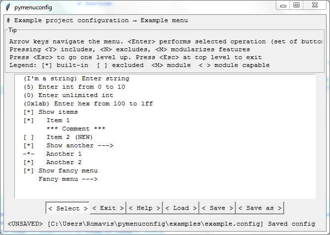

## Overview

pymenuconfig is a small and simple frontend to Kconfiglib that's written
entirely in Python using Tkinter as its GUI toolkit. It mimics Linux kernel 'menuconfig' a lot.

## User interface

I've tried to replicate look and fill of Linux kernel 'menuconfig' tool that
many users are used to, including keyboard-oriented control and textual
representation of menus with fixed-width font. People who are already familiar
with 'menuconfig' should find 'pymenuconfig' pretty intuitive even in its
current state.

Short intro to keyboard controls:
- `<Left>` and `<Right>` buttons select action (displayed by option boxes at bottom of window)
- `<Up>` and `<Down>` buttons navigate menu list
- `<Return>` button executes selected action
   - `Select`: dive into selected menu or enter symbol value
   - `Exit`: go one menu level up or exit the application
   - `Help`: show help for selected menu node
   - `Open`: open config file
   - `Save`: save changes to current config file
   - `Save As`: save changes to different config file
- `<Escape>` button brings you one menu level up or exits the application from top level menu
- `<Space>` button toggles between option values or selects choice option
- `<y>`, `<n>`, `<m>` buttons set corresponding option value

> **Note:** 'Buttons' displayed at bottom of window are actually option boxes that select action for `<Return>` key.
Clicking on them with mouse doesn't do anything.



## Usage

pymenuconfig is distributed as a single executable python module. It can be
either installed or just dropped in your project. The only dependencies at this
time are:
- Python >= 2.7 (it should work both with 2.7 and 3.x)
- Tkinter (should be part of standard library, but many Linux distros omit it by default)
- Kconfiglib >= 2

1. Install
   ```
   python setup.py install
   ```
1. Run it
   - Module installed system-wide
      ```
      python -m pymenuconfig --kconfig Kconfig
      ```
   - Module file dropped into your project
      ```
      python pymenuconfig.py --kconfig Kconfig
      ```
   - Run it from your script by passing command line arguments
      ```
      import pymenuconfig
      
      pymenuconfig.main(['--kconfig', 'Kconfig'])
      ```
   - Instantiate main window class and run Tkinter main loop manually
      ```
      import pymenuconfig
      import kconfiglib
      import tkinter
      
      kconfig = kconfiglib.Kconfig()
      mconfig = pymenuconfig.MenuConfig(kconfig)
      
      tkinter.mainloop()
      ```

### Command line arguments

As with many scripts based on argparse, a complete list of options may be obtained by passing `--help`:
```
python pymenuconfig.py --help
```

## License

See [LICENSE.txt](LICENSE.txt)

